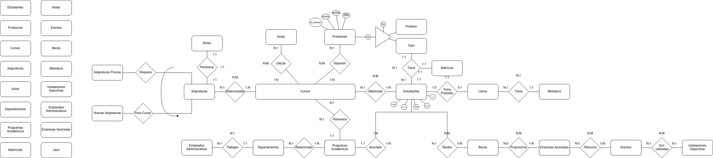

# PROYECTO BASE DE DATOS 1 DAW

## ÍNDICE

   **[Descripción](#descripción)**

   **[Diagrama_Entidad_Relación](#diagrama_entidad_relación)**   
   
   **[Modelo_Relacional](#modelo_relacional)**

   **[Normalización](#normalización)**

   **[Creación_de_estructura_de_bbdd](#creación_de_la_estructura_de_bbdd)**

## DESCRIPCIÓN

Este es un proyecto grupal para la asignatura Base de Datos de 1º CFGS DAW (Desarrollo de Aplicaciones Web). El objetivo de dicho proyecto es la creación de una Base de Datos para una Universidad, en la que habrán entidades como alumnos, profesores, cursos, materias, etc. 
1. Crear el modelo *Entidad-Relación* de la Universidad, tras haber analizado todas sus entidades, propiedades y posibles relaciones entre las mismas.
2. Transformar el Diagrama Entidad-Relación creado previamente al Modelo Relaccional, teniendo en cuenta la cardinalidad de las relaciones del diagrama.
3. Realizar la normalización del Modelo Relacional resultante a la primera, segunda, tercera y cuarta forma normal.
4. Crear la Base de Datos en sqlite3 mediante la terminal. Este proceso se compone por la creación de las tablas y la inserción de su correspondiente información.

   
## DIAGRAMA_ENTIDAD_RELACIÓN

El primero de los pasos quie debíamos seguir para poder crear la Base de Datos que nos propone el ejercicio era crear el Diagrama Entidad-Relación. Gracias a este diagrama, podemos ver de forma bastante clara la base de datos, con sus entidades y relaciones, además de que ya la estaremos preparando para completar los siguientes pasos de forma más sencilla. Este diagrama lo pudimos completar siguiendo tres pasos:

* Lo primero que hicimos fue identificar todas las entidades que estaban presentes en el enunciado. Encontramos un total de 16 entidades, ya fueran comunes, jerárquicas o incluso autoreflexivas.
* Ya una vez completado este paso, pasaríamos a analizar y establecer las distintas relaciones que se dan entre las entidades que hemos definido previamente, surgiendo de esta forma distintos tipos de cardinalidades.
* Una vez identificadas las entidades y definidas las relaciones que conectan las mismas, lo último que nos quedaba era ir conectando todas las entidades y relaciones, dando lugar al Diagrama Entidad-Relación que se nos pedía.

## MODELO_RELACIONAL

Ya una vez creado el DIagrama Entidad-Relación, era hora de convertirlo al Modelo Relacional. En este, las entidades pasan a ser tablas, además de que en determinados casos las relacionés también podrán generar de las mismas, dependiendo de su cardinalidad. Al igual que el resto, el Modelo Relacional lo hicimos en una serie de pasos:

* El primer paso que llevamos a cabo fue el de la conversión de las entidades a tablas. Estas tablas tienen el nombre y propiedades de la entidad, siendo la propiedad más importante la *PK* o *Primary Key* de la tabla. En el caso de las entidades que en el Diagrama ENtidad-Relación no tenían propiedades, se le asignaba automáticamente una *PK* con el nombre "id_nombredelaentidad".
* Ya creadas la stablas correspondientes a las entidades, quedaba relacionarlas entre sí, de la misma manera que en el diagrama del paso previo. Esta vez no era tan sencillo, pues se podían dar distintos casos dependiendo de las cardinalidades:
    * La relación genera tabla: En estos casos, había que crear una tabla con el nombre de la relación, la cual incluiría las PK de cada una de las entidades involucradas en la misma.
    * La relación no genera tabla: Por otro lado, cuando la relación no genera tabla, una de las entidades adoptará la PK de la otra como *FK* o *Foreign Key*, además de algunas de sus propiedades.

  Ya una vez completados lo9s pasos redactados en el apartado previo, ye teníamos nuestra Base de Datos convertida al Modelo Relacional.

##  NORMALIZACIÓN

Por último, nos queda normalizar la Base de Datos. Esto se hace principalmente para eliminar la redundancia de información, además de simplificar la base de datos con la información más importante. Este proceso se divide en distintas fases, conocidas como las *Fases Normales*, estando la *1FN*, *2FN*, *3FN*, *4FN*, y *5FN* (aunque este proyecto no llevaremos la normalización hasta esta última). 

   
## PRIMERA FORMA NORMAL (1FN)

Estudiante

| DNI (PK)      | Nombre | Apellidos   | Dirección Postal           | Email             | Profesor (FK) |
|---------------|--------|-------------|----------------------------|-------------------|------------|
| 11111111D     | Ricarddo  | Zamora      | Avenida La Gallega, 3   | ricardozamora@gmail.com   | ID_Profesor1   |
| 22222222F     | Omar   | González        | Paseo Fermín Rodríguez, 2A   | omargonzalez@gmail.com    | ID_Profesor1   |
| 33333333G    | Ángel  | Pérez    | Calle San Agustín, 30     | angelperez@gmail.com   | ID_Profesor2   |
| 44444444H     | Rodrigo   | Rodríguez       | Calle Las Cabezas, 7   | rodrigorodriguez@gmail.com | ID_Profesor2   |

Profesor

| ID_Profesor (PK) | Profesor_Name | ID_Departamento (FK) |
|---------------|------------|----------------------|
| ID_Profesor1     | Johatam  | ID_Departamento1     |
| ID_Profesor2     | Sergio  | ID_Departamento2     |

Estudiante_Programa

| DNI_Estudiante (PK, FK) | ID_Programa (FK) |
|--------------------------|------------------
| 11111111D               | ID_Programa1     | 
| 22222222F               | ID_Programa2     | 
| 33333333G               | ID_Programa1     | 
| 44444444H               | ID_Programa2     |

Matricula

| ID_Matrícula (PK) | DNI_Estudiante (FK) | ID_Curso (FK) | 
|-------------------|----------------------|---------------|
| 1                 | 11111111D           | ID_Curso1     |
| 2                 | 22222222F           | ID_Curso2     | 
| 3                 | 33333333G           | ID_Curso1     | 
| 4                 | 44444444H           | ID_Curso2     |

Nota

| ID_Nota (PK) | DNI_Estudiante (FK) | ID_Asignatura (FK) | Calificación |
|--------------|----------------------|--------------------|--------------|
| 1            | 11111111D           | ID_Asignatura1     | 6           |
| 2            | 22222222F           | ID_Asignatura2     | 8           |
| 3            | 33333333G           | ID_Asignatura1     | 9           | 
| 4            | 44444444H           | ID_Asignatura2     | 4             |

Curso

| ID_Curso (PK) | Nombre     | ID_Programa (FK) | ID_Profesor (FK) |
|---------------|------------|------------------|------------------|
| ID_Curso1     | Curso1_Name| ID_Programa1     | ID_Profesor1     | 
| ID_Curso2     | Curso2_Name| ID_Programa2     | ID_Profesor2     |

Curso_Profesor

| ID_Curso (PK, FK) | ID_Profesor (PK, FK) |
|---------------------|-----------------------|
| ID_Curso1           | ID_Profesor1          | 
| ID_Curso2           | ID_Profesor2          |

Curso_Asignatura

| ID_Curso (PK, FK) | ID_Asignatura (PK, FK) |
|---------------------|-------------------------|
| ID_Curso1           | ID_Asignatura1          |
| ID_Curso2           | ID_Asignatura2          |

Asignatura_Prerequisito

| ID_Asignatura (PK, FK) | ID_Prerequisito (PK, FK) |
|-------------------------|---------------------------|
| ID_Asignatura1          | ID_Prerequisito1          | 
| ID_Asignatura2          | ID_Prerequisito2          | 

Curso_Aula

| ID_Curso (PK, FK) | ID_Aula (PK, FK) |
|---------------------|-------------------|
| ID_Curso1           | ID_Aula1          |
| ID_Curso2           | ID_Aula2          | 

Programa_Departamento

| ID_Programa (PK, FK) | ID_Departamento (PK, FK) |
|-----------------------|---------------------------|
| ID_Programa1          | ID_Departamento1          |
| ID_Programa2          | ID_Departamento2          | 

Evento_Deportivo

| ID_Evento_Deportivo (PK) | ID_Evento (FK) | ID_Instalación (FK) |
|--------------------------|----------------|---------------------|
| 1                        | ID_Evento1     | ID_Instalación1     |
| 2                        | ID_Evento2     | ID_Instalación2     | 

Empleado_Administrativo

| ID_Empleado (PK) | DNI     | Nombre | Apellidos | ID_Departamento (FK) | 
|-------------------|-------------|--------|-----------|----------------------|
| 1                 | DNI1        | Daniel | Zamora | ID_Departamento1   |
| 2                 | DNI2        | Adrián | Pérez | ID_Departamento2 |

## SEGUNDA FORMA NORMAL (2FN)

Estudiante

| DNI (PK)      | Nombre | Apellidos   | Dirección Postal           | Profesor (FK) |
|---------------|--------|-------------|----------------------------|------------|
| 11111111D     | Ricarddo  | Zamora      | Avenida La Gallega, 3   | ID_Profesor1   |
| 22222222F     | Omar   | González        | Paseo Fermín Rodríguez, 2A   | ID_Profesor1   |
| 33333333G    | Ángel  | Pérez    | Calle San Agustín, 30     | ID_Profesor2   |
| 44444444H     | Rodrigo   | Rodríguez       | Calle Las Cabezas, 7   | ID_Profesor2   |

Profesor

| ID_Profesor (PK) | Profesor_Name | ID_Departamento (FK) |
|---------------|------------|----------------------|
| ID_Profesor1     | Johatam  | ID_Departamento1     |
| ID_Profesor2     | Sergio  | ID_Departamento2     |

Departamento

| ID_Departamento (PK) | Nombre_Departamento |
|----------------------|---------------------|
| ID_Departamento1     | BAE |
| ID_Departamento2     | PRO |

Estudiante_Programa

| DNI_Estudiante (PK, FK) | ID_Programa (FK) | 
|--------------------------|------------------|
| 11111111D               | ID_Programa1     |
| 22222222F               | ID_Programa2     |
| 33333333G               | ID_Programa1     |
| 44444444H               | ID_Programa2     |

Programa

| ID_Programa (PK) | Nombre_Programa | 
|------------------|-----------------|
| ID_Programa1     | Programa1 |
| ID_Programa2     | Programa2 |

Matricula

| ID_Matrícula (PK) | DNI_Estudiante (FK) | ID_Curso (FK) | 
|-------------------|----------------------|---------------|
| 1                 | 11111111D           | ID_Curso1     |
| 2                 | 22222222F           | ID_Curso2     |
| 3                 | 33333333G           | ID_Curso1     |
| 4                 | 44444444H           | ID_Curso2     |

Curso

| ID_Curso (PK) | Nombre_Curso | ID_Programa (FK) | 
|---------------|--------------|------------------|
| ID_Curso1     | 1  bach | ID_Programa1     |
| ID_Curso2     | 2 bach | ID_Programa2     |

Curso_Profesor

| ID_Curso (PK, FK) | ID_Profesor (FK) | 
|---------------------|------------------|
| ID_Curso1           | ID_Profesor1     |
| ID_Curso2           | ID_Profesor2     |

Curso_Asignatura

| ID_Curso (PK, FK) | ID_Asignatura (FK) | 
|---------------------|---------------------|
| ID_Curso1           | ID_Asignatura1      |
| ID_Curso2           | ID_Asignatura2      |

Asignatura

| ID_Asignatura (PK) | Nombre_Asignatura | 
|---------------------|-------------------|
| ID_Asignatura1      | BAE |
| ID_Asignatura2      | PRO |

Asignatura_Prerequisito

| ID_Asignatura (PK, FK) | ID_Prerequisito (FK) | 
|-------------------------|----------------------|
| ID_Asignatura1          | ID_Prerequisito1     |
| ID_Asignatura2          | ID_Prerequisito2     |

Curso_Aula

| ID_Curso (PK, FK) | ID_Aula (PK, FK) | 
|---------------------|-------------------|
| ID_Curso1           | ID_Aula1          |
| ID_Curso2           | ID_Aula2          |

Aula

| ID_Aula (PK) | Nombre_Aula | 
|--------------|--------------|
| ID_Aula1     | 102 |
| ID_Aula2     | 103 |

Programa_Departamento

| ID_Programa (PK, FK) | ID_Departamento (PK, FK) | 
|-----------------------|---------------------------|
| ID_Programa1          | ID_Departamento1          |
| ID_Programa2          | ID_Departamento2          |

Evento_Deportivo

| ID_Evento_Deportivo (PK) | ID_Evento (FK) | ID_Instalación (FK) | 
|--------------------------|----------------|---------------------|
| 1                        | ID_Evento1     | ID_Instalación1     |
| 2                        | ID_Evento2     | ID_Instalación2     |

Empleado_Administrativo

| ID_Empleado (PK) | DNI     | Nombre | Apellidos | ID_Departamento (FK) | 
|-------------------|-------------|--------|-----------|----------------------|
| 1                 | DNI1        | Daniel | Zamora | ID_Departamento1   |
| 2                 | DNI2        | Adrián | Pérez | ID_Departamento2 |

Instalación_Deportiva

| ID_Instalación (PK) | Nombre_Instalación | 
|----------------------|--------------------|
| ID_Instalación1      | Cancha1 |
| ID_Instalación2      | Cancha2 |

## TERCERA FORMA NORMAL (3FN)

Estudiante

| DNI (PK)      | Nombre | Apellidos   | Dirección Postal           | Profesor (FK) |
|---------------|--------|-------------|----------------------------|------------|
| 11111111D     | Ricarddo  | Zamora      | Avenida La Gallega, 3   | ID_Profesor1   |
| 33333333F     | Omar   | González        | Paseo Fermín Rodríguez, 2A   | ID_Profesor1   |
| 33333333G    | Ángel  | Pérez    | Calle San Agustín, 30     | ID_Profesor2   |
| 44444444H     | Rodrigo   | Rodríguez       | Calle Las Cabezas, 7   | ID_Profesor2   |

Profesor

| ID_Profesor (PK) | Profesor_Name | 
|---------------|------------|
| ID_Profesor1     | Johatam       |
| ID_Profesor2     | Sergio      |

Departamento

| ID_Departamento (PK) | Nombre_Departamento |
|----------------------|---------------------|
| ID_Departamento1     | BAE         |
| ID_Departamento2     | PRO              |

Estudiante_Programa

| DNI_Estudiante (PK, FK) | ID_Programa (FK) | 
|--------------------------|------------------|
| 11111111D               | ID_Programa1     |
| 33333333F               | ID_Programa2     |
| 33333333G               | ID_Programa1     |
| 44444444H               | ID_Programa2     |

Programa

| ID_Programa (PK) | Nombre_Programa | ID_Departamento (FK) |
|------------------|-----------------|----------------------|
| ID_Programa1     | Programa1             | ID_Departamento1     |
| ID_Programa2     | Programa2            | ID_Departamento2     |

Matricula

| ID_Matrícula (PK) | DNI_Estudiante (FK) | ID_Curso (FK) | 
|-------------------|----------------------|---------------|
| 1                 | 11111111D           | ID_Curso1     |
| 2                 | 33333333F           | ID_Curso2     |
| 3                 | 33333333G           | ID_Curso1     |
| 4                 | 44444444H           | ID_Curso2     |

Curso

| ID_Curso (PK) | Nombre_Curso | ID_Programa (FK) | 
|---------------|--------------|------------------|
| ID_Curso1     | 1 bach        | ID_Programa1     |
| ID_Curso2     | 2 bach        | ID_Programa2     |

Curso_Profesor

| ID_Curso (PK, FK) | ID_Profesor (FK) | 
|---------------------|------------------|
| ID_Curso1           | ID_Profesor1     |
| ID_Curso2           | ID_Profesor2     |

Curso_Asignatura

| ID_Curso (PK, FK) | ID_Asignatura (FK) | 
|---------------------|---------------------|
| ID_Curso1           | ID_Asignatura1      |
| ID_Curso2           | ID_Asignatura2      |

Asignatura

| ID_Asignatura (PK) | Nombre_Asignatura | 
|---------------------|-------------------|
| ID_Asignatura1      | BAE       |
| ID_Asignatura2      | PRO            |

Asignatura_Prerequisito

| ID_Asignatura (PK, FK) | ID_Prerequisito (FK) | 
|-------------------------|----------------------|
| ID_Asignatura1          | ID_Prerequisito1     |
| ID_Asignatura2          | ID_Prerequisito2     |

Curso_Aula

| ID_Curso (PK, FK) | ID_Aula (PK, FK) | 
|---------------------|-------------------|
| ID_Curso1           | ID_Aula1          |
| ID_Curso2           | ID_Aula2          |

Aula

| ID_Aula (PK) | Nombre_Aula | 
|--------------|--------------|
| ID_Aula1     | 102          |
| ID_Aula2     | 103          |

Programa_Departamento

| ID_Programa (PK, FK) | ID_Departamento (PK, FK) | 
|-----------------------|---------------------------|
| ID_Programa1          | ID_Departamento1          |
| ID_Programa2          | ID_Departamento2          |

Evento_Deportivo

| ID_Evento_Deportivo (PK) | ID_Evento (FK) | ID_Instalación (FK) | 
|--------------------------|----------------|---------------------|
| 1                        | ID_Evento1     | ID_Instalación1     |
| 2                        | ID_Evento2     | ID_Instalación2     |

Empleado_Administrativo

| ID_Empleado (PK) | DNI  | Nombre | Apellidos | ID_Departamento (FK) | 
|-------------------|----------|--------|-----------|----------------------|
| 1                 | DNI1     | Daniel  | Zamora    | ID_Departamento1     |
| 2                 | DNI2     | Adrián | Pérez | ID_Departamento2    |

Instalación_Deportiva

| ID_Instalación (PK) | Nombre_Instalación | 
|----------------------|--------------------|
| ID_Instalación1      | Cancha1            |
| ID_Instalación2      | Cancha2            |

## CREACIÓN_DE_LA_ESTRUCTURA_DE_BBDD

La creación de la Base de Datos se hará en la terminal, con el uso de sqlite3. Para ello, se seguirán unos pasos en la terminal:
1. Create Table:
   Se crearán todas las tablas de la base de datos en la terminal, pero estarán vacías, por lo que tendremos que pasar al siguiente paso.
2. Inserts:
   Con el uso de la función Insert, se introducirá a las tablas toda la información que corresponde a cada una de ellas. 
   

   
## AUTORES

### [Ricardo Zamora](https://github.com/21ricardozamora)

### [Ángel Pérez](https://github.com/Angel170605)

